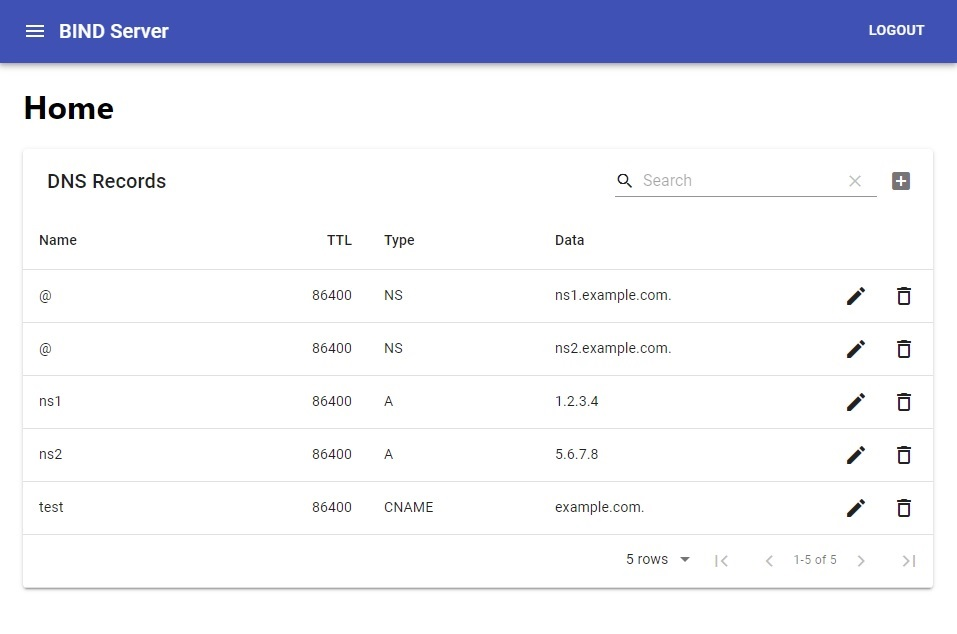

# BIND UI

A simple web client for BIND.



**Notes:**
1. It's best to start with a fresh zone file since the parser is not very sophisticated.
2. A firebase account is needed for storing user credentials.


## Installation

1. Ensure *named-checkzone* and *rndc* are installed and can be run by the user who will be running the webserver. (The user usually has to belong to this *bind* group)
```
named-checkzone $ORIGIN $ZONE_FILE
rndc reload
```
2. Ensure that the user who will be running the webserver can read and write the zone file
3. Add *.env* file to the root directory of this repository with the following properties
```
ZONE_FILE=<zone-file-location>
ORIGIN=<origin>
SECRET=<session-secret>
FIREBASE_API_KEY=<api-key>
FIREBASE_PROJECT_ID=<project-id>
```
4. Run `npm install && npm run build`
5. Run `npm run pm2-install` and navigate to [http://localhost:3001](http://localhost:3001)